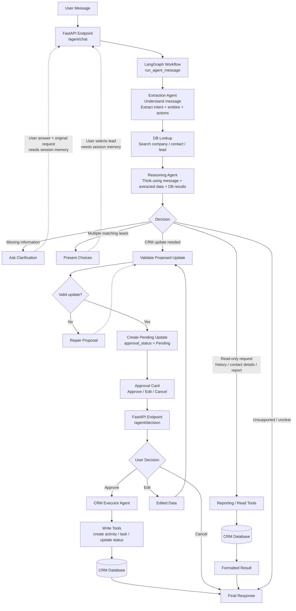

# DealForge Agent Workflow

```mermaid
flowchart TD

A[User Message] --> B[FastAPI Endpoint<br>/agent/chat]

B --> C[LangGraph Workflow<br>run_agent_message]

C --> D[Extraction Agent<br>Understand message<br>Extract intent + entities + actions]

D --> E[DB Lookup<br>Search company / contact / lead]

E --> F[Reasoning Agent<br>Think using message + extracted data + DB results]

F --> G{Decision}

G -->|Missing information| H[Ask Clarification]
H -.->|User answer + original request<br>needs session memory| B

G -->|Multiple matching leads| I[Present Choices]
I -.->|User selects lead<br>needs session memory| B

G -->|CRM update needed| J[Validate Proposed Update]

J --> K{Valid update?}

K -->|No| L[Repair Proposal]
L -.-> J

K -->|Yes| M[Create Pending Update<br>approval_status = Pending]

M --> N[Approval Card<br>Approve / Edit / Cancel]

N --> O[FastAPI Endpoint<br>/agent/decision]

O --> P{User Decision}

P -->|Approve| Q[CRM Executor Agent]
Q --> R[Write Tools<br>create activity / task / update status]
R --> S[(CRM Database)]
S --> T[Final Response]

P -->|Edit| U[Edited Data]
U --> J

P -->|Cancel| T

G -->|Read-only request<br>history / contact details / report| V[Reporting / Read Tools]
V --> W[(CRM Database)]
W --> X[Formatted Result]
X --> T

G -->|Unsupported / unclear| T
```