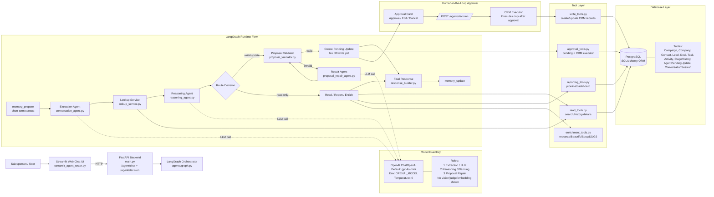

# DealForge AI CRM Agent — Architecture

```mermaid
flowchart LR
    U[Salesperson / User] --> UI[Streamlit Web Chat UI\nstreamlit_agent_tester.py]
    UI -->|HTTP| API[FastAPI Backend\nmain.py\n/agent/chat + /agent/decision]

    subgraph M[Model Inventory]
        LLM[OpenAI ChatOpenAI\nDefault: gpt-4o-mini\nEnv: OPENAI_MODEL\nTemperature: 0]
        MR[Roles:\n1 Extraction / NLU\n2 Reasoning / Planning\n3 Proposal Repair\nNo vision/judge/embedding shown]
        LLM --- MR
    end

    API --> G[LangGraph Orchestrator\nagents/graph.py]

    subgraph GFlow[LangGraph Runtime Flow]
        MP[memory_prepare\nshort-term context] --> EX[Extraction Agent\nconversation_agent.py]
        EX --> LU[Lookup Service\nlookup_service.py]
        LU --> RA[Reasoning Agent\nreasoning_agent.py]
        RA --> RD{Route Decision}
        RD -->|write/update| VP[Proposal Validator\nproposal_validator.py]
        VP -->|valid| CP[Create Pending Update\nNo DB write yet]
        VP -->|invalid| RP[Repair Agent\nproposal_repair_agent.py]
        RP --> VP
        RD -->|read-only| RRE[Read / Report / Enrich]
        CP --> FR[Final Response\nresponse_builder.py]
        RRE --> FR
        FR --> MU[memory_update]
    end

    EX -. LLM call .-> LLM
    RA -. LLM call .-> LLM
    RP -. LLM call .-> LLM

    subgraph Tools[Tool Layer]
        RT[read_tools.py\nsearch/history/details]
        WT[write_tools.py\ncreate/update CRM records]
        AT[approval_tools.py\npending + CRM executor]
        REP[reporting_tools.py\npipeline/dashboard]
        EN[enrichment_tools.py\nrequests/BeautifulSoup/DDGS]
    end

    LU --> RT
    RRE --> RT
    RRE --> REP
    RRE --> EN
    CP --> AT

    subgraph HITL[Human-in-the-Loop Approval]
        Card[Approval Card\nApprove / Edit / Cancel] --> Decision[/POST /agent/decision/]
        Decision --> Executor[CRM Executor\nExecutes only after approval]
    end

    CP --> Card
    Executor --> WT

    subgraph DB[Database Layer]
        PG[(PostgreSQL\nSQLAlchemy ORM)]
        Tables[Tables:\nCampaign, Company, Contact, Lead, Deal, Task, Activity, StageHistory, AgentPendingUpdate, ConversationSession]
    end

    RT --> PG
    WT --> PG
    AT --> PG
    REP --> PG
    PG --- Tables
```
